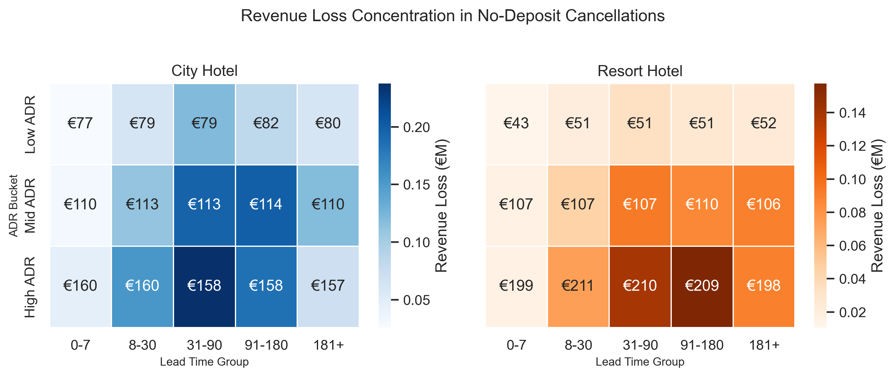

# Reducing Revenue Loss from Hotel Cancellations

A portfolio case study that investigates hotel booking cancellations from a revenue management perspective.

## Project Goal

This project asks one central business question:

**What drives cancellation, and where should hotels focus first to reduce revenue loss?**

The analysis focuses on two hotel types:

- `City Hotel`
- `Resort Hotel`

Rather than treating the dataset as a generic EDA exercise, the project frames cancellations as a business problem tied to pricing, booking commitment, and channel strategy.

## Key Business Findings

### 1. Cancellations are financially meaningful

- Overall cancellation rate is about `27.9%`
- Estimated revenue loss is about `€2.8M`
- `City Hotel` has both the higher cancellation rate and the larger total revenue loss

### 2. No-deposit, long lead-time bookings drive the majority of loss

- In `City Hotel`, no-deposit bookings made more than `31` days in advance account for about `€1.3M`, or roughly `71%`, of no-deposit cancellation loss
- In `Resort Hotel`, the same pattern accounts for about `€0.7M`, or roughly `80%`, of no-deposit cancellation loss

### 3. Market segment risk depends on both source and booking conditions

- Cancellation contribution is not evenly distributed across market segments
- Some segments matter because they bring high volume
- Others matter because they combine high cancellation contribution with flexible deposit structure

## Master Charts

### Master Chart 1

Revenue loss concentration in no-deposit cancellations:



### Master Chart 2

Market segment contribution to hotel cancellations:


## Portfolio Assets

- Quarto portfolio source: [notebooks/hotel_booking_portfolio.qmd](notebooks/hotel_booking_portfolio.qmd)
- Portfolio HTML: [notebooks/hotel_booking_portfolio.html](notebooks/hotel_booking_portfolio.html)
- Portfolio PDF: [notebooks/hotel_booking_portfolio.pdf](notebooks/hotel_booking_portfolio.pdf)
- Analysis notebook: [notebooks/Hotel_booking_cancellation_analysis.ipynb](notebooks/Hotel_booking_cancellation_analysis.ipynb)
- Executive summary: [notebooks/hotel_booking_executive_summary.pdf](notebooks/hotel_booking_executive_summary.pdf)

## Project Structure

```text
Hotel_booking_demand/
├── data/
├── notebooks/
│   ├── Hotel_booking_cancellation_analysis.ipynb
│   ├── hotel_booking_portfolio.qmd
│   ├── hotel_booking_portfolio.html
│   └── hotel_booking_portfolio.pdf
├── outputs/
│   ├── master_chart_1_no_deposit_revenue_loss.png
│   └── master_chart_2_market_segment_cancellation_mix.png
└── README.md
```

## Tools Used

- Python
- pandas
- seaborn
- matplotlib
- Jupyter Notebook
- Quarto

## About Me

Before moving into data analysis, I worked in the hotel and travel industry as an e-commerce manager. That background shaped how I approached this case study: not only asking whether a pattern exists, but whether it is meaningful for pricing, demand uncertainty, and revenue performance.

I am currently deepening that operating experience through data analysis, with a focus on Python, Positron, and Quarto to investigate business problems more rigorously and communicate them more clearly.
