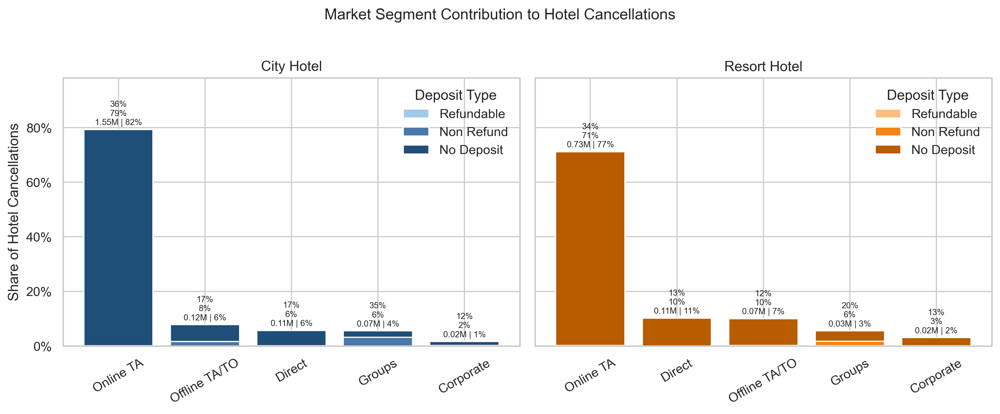

## Project Overview

This project investigates one central business problem in the hotel industry: booking cancellations.

The analysis focuses on two hotel types, `City Hotel` and `Resort Hotel`, and aims to answer three practical questions:

1. How serious is the cancellation problem?
2. Which booking patterns are most strongly associated with cancellation?
3. Which areas should be prioritized from a revenue management perspective?

Rather than treating this as a generic EDA exercise, I approached it as a stakeholder-facing business case: identify where cancellation loss is concentrated, explain why it happens, and translate the findings into operational recommendations.

## About Me

Before moving into data analysis, I worked in the hotel and travel industry as an e-commerce manager, where I was directly involved in revenue growth, channel operations, and day-to-day commercial decision-making.

That operating background shaped the way I approached this project. I am not only interested in whether a pattern is statistically visible, but also whether it is meaningful for pricing, customer behavior, and business performance. In previous roles, I helped scale a store from annual sales in the millions to roughly `400M RMB`, and I also contributed to doubling Douyin GMV within six months.

I am now deepening that commercial experience through data analysis, with a focus on tools such as Python, Positron, and Quarto. My goal is to combine hands-on business intuition with stronger analytical methods so I can investigate data more rigorously, communicate findings more clearly, and support better decisions.

## Business Context

For hotels, cancellations reduce realized revenue and create uncertainty in occupancy planning, pricing strategy, and inventory management. The business impact is especially high when:

- cancellations happen at scale
- high-value bookings are canceled
- flexible booking conditions allow customers to delay commitment

This analysis was framed from the perspective of a revenue team trying to identify where cancellation risk is most concentrated.

## Dataset

Source: Kaggle hotel booking demand dataset  
Scope after cleaning: `85,586` bookings  
Hotels covered:

- `City Hotel`
- `Resort Hotel`

Core metrics used in this project:

- `Cancellation Rate`: mean of `is_canceled`
- `Booking Volume`: number of bookings
- `Revenue Loss Proxy`: `adr * is_canceled`

## Data Preparation

The cleaning logic followed a business-first approach rather than mechanically filling or dropping values.

Main steps:

- standardize pseudo-missing values such as `NULL`
- fill count fields such as `children` and `babies` with `0`
- remove exact duplicates only
- create validation fields such as `total_guests` and `total_room_nights`
- remove clearly invalid rows where `adr <= 0`, `total_guests <= 0`, or `total_room_nights <= 0`

This ensured that the analysis focused on plausible hotel bookings rather than data-entry artifacts.

## Analytical Focus

The project started with broad EDA, then narrowed to the highest-impact cancellation patterns.

The final analytical story centered on:

- cancellation severity by hotel
- lead time as a major behavioral driver
- deposit policy as the strongest operational lever
- market segment structure behind cancellation losses

## Key Finding 1

### Cancellation Is a Material Revenue Problem

The overall cancellation rate is approximately `27.9%`, representing an estimated revenue loss of about `€2.8M`.

`City Hotel` shows both:

- a higher cancellation rate than `Resort Hotel`
- a larger share of total revenue loss

This makes `City Hotel` the higher-priority area for intervention.

## Key Finding 2

### No-Deposit, Long Lead-Time Bookings Drive Most Revenue Loss

The strongest and most actionable pattern in the project is the concentration of revenue loss in bookings that are both:

- booked far in advance
- not protected by a deposit

In particular:

- `City Hotel`: bookings made more than `31` days in advance account for about `€1.3M`, or roughly `71%`, of no-deposit cancellation loss
- `Resort Hotel`: bookings made more than `31` days in advance account for about `€0.7M`, or roughly `80%`, of no-deposit cancellation loss

This suggests that unsecured long-horizon bookings function like low-commitment options for customers, creating disproportionate revenue risk.

### Master Chart 1

How to read this chart:

- darker cells indicate higher revenue loss
- columns represent booking horizon
- rows represent ADR tiers after trimming extreme outliers

The main takeaway is that loss is concentrated in `31+ day` bookings, especially in the mid-to-high ADR range.

## Key Finding 3

### Market Segment Risk Is Not Just About Volume, but Also About Booking Conditions

Market segment analysis showed that cancellation contribution is not evenly distributed across channels. Some segments matter because they bring high volume, but the more important insight is that deposit structure changes their risk profile.

The market segment view shows:

- which segments contribute the largest share of hotel cancellations
- how much of that share is tied to `No Deposit`
- how much revenue loss each segment represents

### Master Chart 2

How to read this chart:

- bar height shows each segment's share of hotel cancellations
- stack color shows deposit structure
- annotations summarize cancellation rate, cancellation share, and revenue loss

This makes it easier to separate:

- high-volume segments
- high-risk segments
- high-revenue-loss segments

## Business Recommendations

Based on the final analysis, the most practical actions would be:

1. Introduce stricter deposit rules for bookings made more than `31` days in advance.
2. Prioritize `City Hotel` for cancellation reduction because its overall business impact is larger.
3. Review high-impact market segments where cancellation contribution and no-deposit exposure overlap.
4. Treat long lead-time bookings as a revenue-risk class rather than only a demand source.

## What I Learned

This was my first full end-to-end business data analysis case study. The most valuable lessons were:

- how to turn a broad dataset into one core business question
- how to clean data using business meaning, not only technical rules
- how to reduce many charts into a few high-signal visuals
- how to translate EDA into business language for stakeholders

More broadly, this project helped me move from “using analysis tools” to thinking more like an analyst: narrowing scope, defending metric choices, and deciding which insights are worth elevating into an executive summary.

## Tools Used

- Python
- pandas
- seaborn
- matplotlib
- Jupyter Notebook
- Quarto

## Project Assets

- Analysis notebook: [Hotel_booking_cancellation_analysis.ipynb](/Users/x/my_analysis/Kaggle Practice/Hotel_booking_demand/notebooks/Hotel_booking_cancellation_analysis.ipynb)
- Executive summary: [hotel_booking_executive_summary.pdf](/Users/x/my_analysis/Kaggle Practice/Hotel_booking_demand/notebooks/hotel_booking_executive_summary.pdf)
- Master chart 1: [master_chart_1_no_deposit_revenue_loss.png](/Users/x/my_analysis/Kaggle Practice/Hotel_booking_demand/outputs/master_chart_1_no_deposit_revenue_loss.png)
- Master chart 2: [master_chart_2_market_segment_cancellation_mix.png](/Users/x/my_analysis/Kaggle Practice/Hotel_booking_demand/outputs/master_chart_2_market_segment_cancellation_mix.png)

## Closing Note

This case study reflects the way I want to approach business analytics work: start from a concrete business question, stay disciplined about scope, and use data to produce decisions that are both defensible and actionable.
